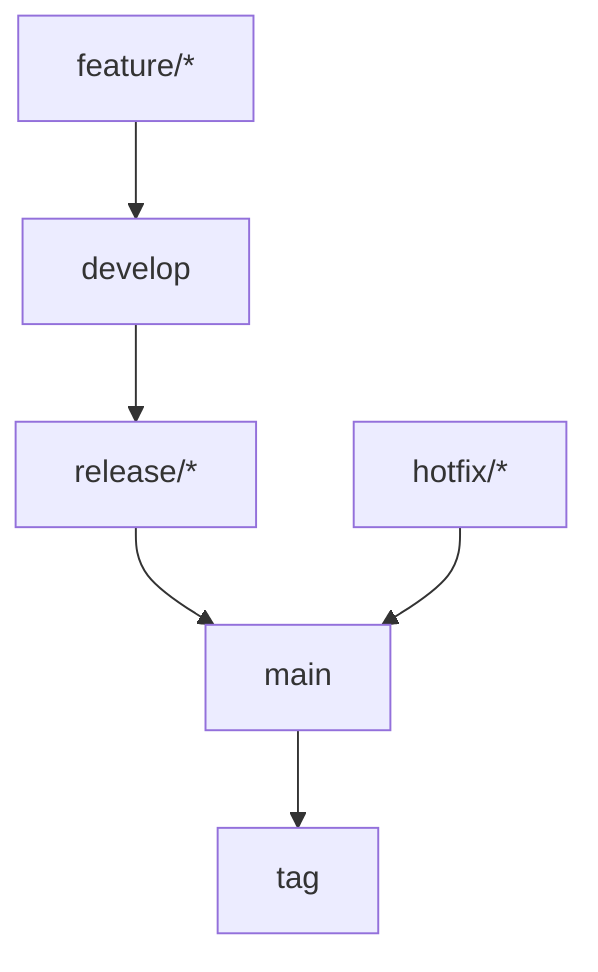

# 代码提交规范

## 概述
本文档定义Rust项目的代码提交规范，包括提交信息格式、分支管理策略、代码审查流程等，确保团队协作的高效性和代码质量的可控性。

---

## 提交信息规范

### 1. 提交信息格式
```
类型(范围): 简短描述

详细描述（可选）

突破性变更说明（可选）
关联Issue（可选）
```

### 2. 提交类型
| 类型 | 说明 | 示例 |
|------|------|------|
| feat | 新功能 | `feat(auth): 添加JWT认证支持` |
| fix | 修复bug | `fix(api): 修复用户查询空指针异常` |
| docs | 文档更新 | `docs(readme): 更新安装说明` |
| style | 代码格式调整 | `style(clippy): 修复clippy警告` |
| refactor | 代码重构 | `refactor(db): 重构数据库连接池` |
| test | 测试相关 | `test(user): 添加用户服务单元测试` |
| chore | 构建过程或辅助工具变动 | `chore(deps): 更新tokio到1.35` |
| perf | 性能优化 | `perf(cache): 优化Redis缓存策略` |
| ci | CI/CD相关 | `ci(github): 添加自动化测试流水线` |
| revert | 回滚提交 | `revert: 回滚错误的功能提交` |

### 3. 提交范围
- 使用模块名或功能名作为范围
- 范围应该具体明确
- 多个范围用逗号分隔

### 4. 示例
```bash
# 新功能
git commit -m "feat(user): 添加用户注册功能

- 实现用户注册API
- 添加密码加密
- 添加输入验证

Closes #123"

# Bug修复
git commit -m "fix(auth): 修复令牌过期时间计算错误

修复JWT令牌过期时间少算1小时的问题

Fixes #456"

# 重构
git commit -m "refactor(db): 重构数据库迁移系统

- 使用SeaORM替换手动SQL
- 添加回滚支持
- 优化迁移性能

BREAKING CHANGE: 迁移文件格式变更，需要重新生成"

# 文档更新
git commit -m "docs(api): 更新API文档

- 添加用户管理API文档
- 更新认证流程说明
- 添加错误码说明"
```

---

## 分支管理策略

### 1. 分支类型
```
main
├── develop
│   ├── feature/user-auth
│   ├── feature/payment
│   └── hotfix/login-bug
├── release/v1.2.0
└── hotfix/prod-issue
```

### 2. 分支命名规范
```bash
# 功能分支
feature/user-authentication
feature/payment-integration

# 修复分支
hotfix/login-error
hotfix/security-patch

# 发布分支
release/v1.2.0
release/v2.0.0

# 重构分支
refactor/database-layer
refactor/api-structure
```

### 3. 分支生命周期


### 4. 分支操作命令
```bash
# 创建功能分支
git checkout -b feature/user-auth develop

# 同步上游分支
git fetch origin
git rebase origin/develop

# 合并功能分支
git checkout develop
git merge --no-ff feature/user-auth
git branch -d feature/user-auth

# 创建发布分支
git checkout -b release/v1.2.0 develop

# 创建热修复分支
git checkout -b hotfix/login-bug main
```

---

## 代码审查流程

### 1. 审查前准备
```bash
# 1. 确保代码通过所有检查
cargo check
cargo clippy -- -D warnings
cargo fmt --check
cargo test

# 2. 更新提交信息（如果需要）
git commit --amend

# 3. 推送分支
git push origin feature/user-auth

# 4. 创建Pull Request
gh pr create --title "feat(user): 添加用户认证" --body "详细描述..."
```

### 2. 审查要点
```markdown
## 代码审查清单

### 功能正确性
- [ ] 功能是否符合需求？
- [ ] 边界条件是否处理？
- [ ] 错误处理是否完整？

### 代码质量
- [ ] 代码是否符合编码规范？
- [ ] 是否有重复代码？
- [ ] 命名是否清晰？

### 性能与安全
- [ ] 是否有性能问题？
- [ ] 是否有安全漏洞？
- [ ] 资源管理是否正确？

### 测试覆盖
- [ ] 是否有单元测试？
- [ ] 测试是否覆盖核心逻辑？
- [ ] 集成测试是否通过？

### 文档
- [ ] 代码是否有文档注释？
- [ ] API文档是否更新？
- [ ] 变更说明是否清晰？
```

### 3. 审查评论规范
```markdown
## 审查评论示例

### 建议性评论
**建议**: 这里可以使用`match`语句提高可读性
```
// 当前代码
if status == "active" {
    // ...
} else if status == "inactive" {
    // ...
} else {
    // ...
}

// 建议代码
match status {
    "active" => { /* ... */ },
    "inactive" => { /* ... */ },
    _ => { /* ... */ },
}
```

### 问题性评论
**问题**: 这里可能发生除零错误
```
// 问题代码
let average = total / count;  // count可能为0

// 修复建议
if count == 0 {
    return Err(Error::DivisionByZero);
}
let average = total / count;
```

### 赞赏性评论
**很好**: 错误处理很完整，考虑了所有可能的情况
```

### 4. 审查响应
```bash
# 1. 查看审查评论
gh pr view 123 --comments

# 2. 回复评论
gh pr comment 123 --body "已修复除零错误，请再次审查"

# 3. 更新代码
git add .
git commit --amend --no-edit
git push --force-with-lease

# 4. 请求再次审查
gh pr review 123 --request-changes --body "请检查修复是否正确"
```

---

## 合并策略

### 1. 合并要求
```yaml
# .github/workflows/pr-check.yml
name: PR Checks
on: [pull_request]

jobs:
  check:
    runs-on: ubuntu-latest
    steps:
      - uses: actions/checkout@v3
      
      - name: Check formatting
        run: cargo fmt --check
        
      - name: Run clippy
        run: cargo clippy -- -D warnings
        
      - name: Run tests
        run: cargo test
        
      - name: Check coverage
        run: cargo tarpaulin --ignore-tests --out Xml
        
      - name: Security audit
        run: cargo audit
```

### 2. 合并方法
```bash
# 1. 确保分支是最新的
git checkout develop
git pull origin develop
git checkout feature/user-auth
git rebase develop

# 2. 解决冲突（如果有）
git mergetool
git rebase --continue

# 3. 运行测试
cargo test

# 4. 合并到develop（使用--no-ff保留分支历史）
git checkout develop
git merge --no-ff feature/user-auth

# 5. 删除功能分支
git branch -d feature/user-auth
git push origin --delete feature/user-auth
```

### 3. 合并后操作
```bash
# 1. 更新版本号（如果需要）
# Cargo.toml
[package]
version = "1.2.0"  # 更新版本号

# 2. 生成变更日志
git log --oneline --no-merges v1.1.0..HEAD

# 3. 创建标签
git tag -a v1.2.0 -m "Release v1.2.0"
git push origin v1.2.0

# 4. 部署到测试环境
cargo build --release
./deploy.sh test
```

---

## 版本管理

### 1. 语义化版本控制（SemVer）
```toml
# Cargo.toml
[package]
name = "myapp"
version = "1.2.3"  # 主版本.次版本.修订号
```

| 版本部分 | 说明 | 更新时机 |
|----------|------|----------|
| 主版本号 | 不兼容的API修改 | 重大重构、架构变更 |
| 次版本号 | 向下兼容的功能性新增 | 新功能、API扩展 |
| 修订号 | 向下兼容的问题修正 | Bug修复、性能优化 |

### 2. 版本发布流程
```bash
# 1. 创建发布分支
git checkout -b release/v1.2.0 develop

# 2. 更新版本号
# Cargo.toml: version = "1.2.0"

# 3. 更新变更日志
# CHANGELOG.md
## [1.2.0] - 2026-04-18
### Added
- 用户认证功能
- API文档生成

### Fixed
- 修复登录错误
- 优化性能

# 4. 提交发布准备
git add .
git commit -m "chore(release): 准备发布v1.2.0"

# 5. 合并到main
git checkout main
git merge --no-ff release/v1.2.0

# 6. 创建标签
git tag -a v1.2.0 -m "Release v1.2.0"

# 7. 合并到develop
git checkout develop
git merge --no-ff release/v1.2.0

# 8. 删除发布分支
git branch -d release/v1.2.0
```

### 3. 热修复流程
```bash
# 1. 从main创建热修复分支
git checkout -b hotfix/login-error main

# 2. 修复问题
# ... 修复代码 ...

# 3. 更新版本号（修订号+1）
# Cargo.toml: version = "1.2.1"

# 4. 提交修复
git add .
git commit -m "fix(auth): 修复登录错误

修复JWT令牌验证逻辑错误

Fixes #789"

# 5. 合并到main和develop
git checkout main
git merge --no-ff hotfix/login-error
git tag -a v1.2.1 -m "Hotfix v1.2.1"

git checkout develop
git merge --no-ff hotfix/login-error

# 6. 删除热修复分支
git branch -d hotfix/login-error
```

---

## 协作规范

### 1. 提交频率
```bash
# 好：小而频繁的提交
git commit -m "feat(user): 添加用户模型"
git commit -m "feat(user): 添加用户仓储接口"
git commit -m "feat(user): 实现用户服务"

# 不好：大而少的提交
git commit -m "feat(user): 实现用户管理功能

- 添加用户模型
- 添加仓储接口  
- 实现服务层
- 添加API端点
- 编写测试"
```

### 2. 提交粒度
```markdown
## 好的提交粒度
- 一个功能点
- 一个Bug修复
- 一个重构任务
- 一组相关的小修改

## 不好的提交粒度
- 多个不相关的修改
- 半成品功能
- 包含调试代码
- 混合功能修改和格式调整
```

### 3. 代码所有权
```markdown
## 代码所有权原则
1. **谁编写，谁负责**: 提交者负责代码质量和维护
2. **集体代码所有权**: 团队共同维护所有代码
3. **知识共享**: 定期进行代码审查和知识分享
4. **交接规范**: 人员变动时进行代码交接
```

### 4. 沟通规范
```markdown
## 提交相关沟通
### Pull Request描述
- 功能概述
- 变更原因
- 测试计划
- 相关Issue

### 审查评论
- 具体明确
- 建设性反馈
- 提供改进建议
- 及时响应

### 变更通知
- 重大变更提前通知
- 影响范围说明
- 迁移指南（如果需要）
- 回滚方案
```

---

## 工具配置

### 1. Git钩子配置
```bash
# .git/hooks/pre-commit
#!/bin/bash

# 检查代码格式
cargo fmt --check
if [ $? -ne 0 ]; then
    echo "代码格式检查失败，请运行: cargo fmt"
    exit 1
fi

# 检查clippy警告
cargo clippy -- -D warnings
if [ $? -ne 0 ]; then
    echo "代码质量检查失败"
    exit 1
fi

# 运行测试
cargo test --lib
if [ $? -ne 0 ]; then
    echo "单元测试失败"
    exit 1
fi

echo "预提交检查通过"
exit 0
```

### 2. Commitizen配置
```json
// .czrc
{
  "path": "cz-conventional-changelog",
  "types": {
    "feat": {
      "description": "新功能",
      "title": "Features"
    },
    "fix": {
      "description": "修复bug",
      "title": "Bug Fixes"
    },
    "docs": {
      "description": "文档更新",
      "title": "Documentation"
    },
    "style": {
      "description": "代码格式调整",
      "title": "Styles"
    },
    "refactor": {
      "description": "代码重构",
      "title": "Code Refactoring"
    },
    "perf": {
      "description": "性能优化",
      "title": "Performance Improvements"
    },
    "test": {
      "description": "测试相关",
      "title": "Tests"
    },
    "chore": {
      "description": "构建过程或辅助工具变动",
      "title": "Chores"
    }
  }
}
```

### 3. GitHub Actions配置
```yaml
# .github/workflows/ci.yml
name: CI

on:
  push:
    branches: [ main, develop ]
  pull_request:
    branches: [ main, develop ]

jobs:
  build:
    runs-on: ubuntu-latest
    
    steps:
    - uses: actions/checkout@v3
    
    - name: Install Rust
      uses: actions-rs/toolchain@v1
      with:
        toolchain: stable
        components: clippy, rustfmt
        
    - name: Cache dependencies
      uses: actions/cache@v3
      with:
        path: |
          ~/.cargo/registry
          ~/.cargo/git
          target
        key: ${{ runner.os }}-cargo-${{ hashFiles('**/Cargo.lock') }}
        
    - name: Check formatting
      run: cargo fmt --check
      
    - name: Run clippy
      run: cargo clippy -- -D warnings
      
    - name: Run tests
      run: cargo test --verbose
      
    - name: Upload coverage
      uses: codecov/codecov-action@v3
      with:
        file: ./coverage.xml
```

---

## 质量门禁

### 1. 提交前检查
```bash
# 必须通过的检查
cargo check          # 编译检查
cargo fmt --check    # 代码格式
cargo clippy         # 代码质量
cargo test           # 单元测试

# 建议通过的检查
cargo audit          # 安全漏洞
cargo tarpaulin      # 测试覆盖率
cargo deny           # 许可证检查
```

### 2. 合并前检查
```yaml
# GitHub分支保护规则
- Require status checks to pass before merging
  - ci/build
  - ci/test
  - ci/lint
  
- Require pull request reviews before merging
  - Required approving reviews: 1
  - Dismiss stale pull request approvals
  
- Require conversation resolution before merging
  
- Include administrators
```

### 3. 发布前检查
```bash
# 发布检查清单
- [ ] 所有测试通过
- [ ] 代码覆盖率达标（≥85%）
- [ ] 安全扫描通过
- [ ] 性能测试通过
- [ ] 文档完整
- [ ] 变更日志更新
- [ ] 版本号更新
- [ ] 回滚方案准备
```

---

## 附录

### 常见问题

#### 1. 如何修改上次提交？
```bash
# 修改提交信息
git commit --amend -m "新的提交信息"

# 修改提交内容
git add .
git commit --amend --no-edit

# 修改更早的提交
git rebase -i HEAD~3
```

#### 2. 如何拆分大提交？
```bash
# 1. 开始交互式rebase
git rebase -i HEAD~5

# 2. 将需要拆分的提交标记为edit
# pick abc123 大提交
# 改为
# edit abc123 大提交

# 3. 重置到该提交
git reset HEAD^

# 4. 分批提交
git add file1.rs
git commit -m "feat: 添加功能A"

git add file2.rs  
git commit -m "feat: 添加功能B"

# 5. 继续rebase
git rebase --continue
```

#### 3. 如何解决合并冲突？
```bash
# 1. 查看冲突文件
git status

# 2. 手动解决冲突
# 编辑有冲突的文件

# 3. 标记冲突已解决
git add resolved_file.rs

# 4. 继续合并
git rebase --continue
# 或
git merge --continue
```

### 工具推荐
1. **git**: 版本控制
2. **gh**: GitHub CLI
3. **commitizen**: 提交信息规范化
4. **pre-commit**: Git钩子管理
5. **conventional-changelog**: 变更日志生成

### 参考资源
1. [Conventional Commits](https://www.conventionalcommits.org/)
2. [Git Flow](https://nvie.com/posts/a-successful-git-branching-model/)
3. [Semantic Versioning](https://semver.org/)
4. [GitHub Flow](https://docs.github.com/en/get-started/using-github/github-flow)